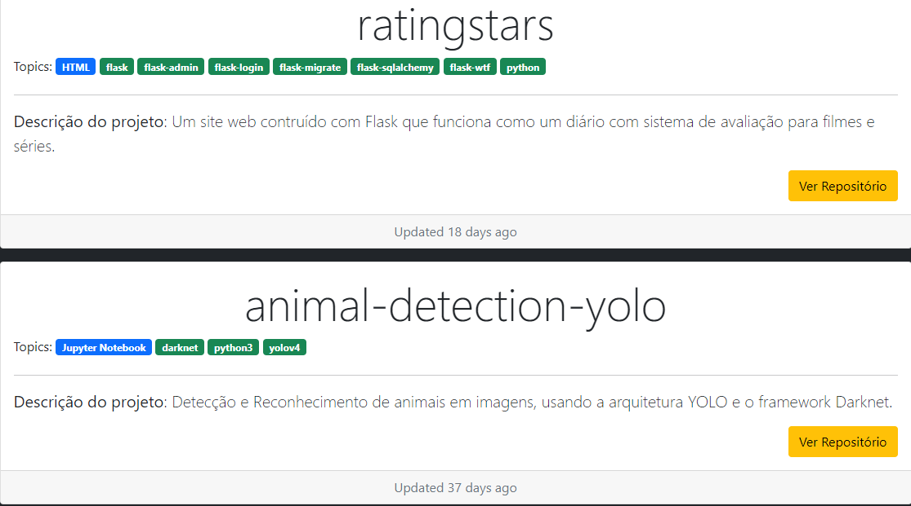

# React and GitHub API

An application used to render my all repositories from GitHub, built with React, JavaScript, JSX, HTML, Bootstrap and CSS.

## 💻 Project Screen Shot

## 🚀 Installation and Setup Instruction

Clone down this repository. You will need node and npm installed globally on your machine.

Installation:

`npm install`

To Start Server:

`npm start`

To Visit App:

`localhost:3000`

## 🛠️ built with 

Tools and langs.

* [Visual Studio Code](https://code.visualstudio.com/docs) 
* [Git](https://git-scm.com/) 
* [Bootstrap](https://getbootstrap.com/docs/4.0/getting-started/introduction/)
* [React](https://pt-br.reactjs.org/docs/getting-started.html) 
* [React-Bootstrap](https://react-bootstrap.github.io/getting-started/introduction)
* [GitHub API](https://docs.github.com/en/rest/guides/getting-started-with-the-rest-api)
* ...

## ✒️ Author

* **DEV** - *Code and Documentation* - [Adriano](https://github.com/adrianomqsmts)
